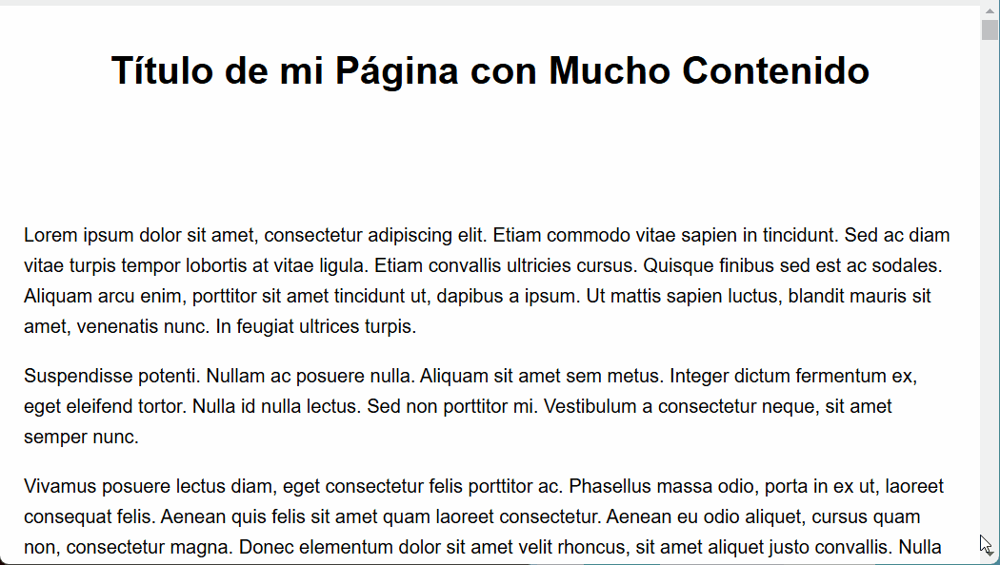

# readingProgressBar.js



**Simple and lightweight JavaScript script to add a reading progress bar to the top of your web pages.**

This script enhances user experience by visually indicating how much of a page's content a user has scrolled through. It's a subtle yet effective way to keep users engaged, especially on long articles or documentation pages.

## Demo

You can see a live demo by opening the `readingProgressBar.html` file in your browser. This file provides a basic example of how to use the script with a long article.

## Installation & Usage

To integrate the reading progress bar into your website, follow these steps:

1.  **Include the CSS:** Add the `readingProgressBar.css` stylesheet to the `<head>` section of your HTML document. You can do this by adding the following line within your `<head>` tags:

    ```html
    <link rel="stylesheet" href="readingProgressBar.css">
    ```

    Make sure the path to `readingProgressBar.css` is correct relative to your HTML file.

2.  **Include the JavaScript:**  Add the `readingProgressBar.js` script before the closing `</body>` tag of your HTML document. Add this line just before `</body>`:

    ```html
    <script src="readingProgressBar.js"></script>
    ```

    Again, ensure the path to `readingProgressBar.js` is correct relative to your HTML file.

3.  **That's it!** The reading progress bar will now appear at the top of your page and automatically update as the user scrolls.

## Customization

You can easily customize the appearance of the progress bar by modifying the `readingProgressBar.css` file. Here are some key CSS properties you can adjust:

*   **`#readingProgressBarContainer`**: Styles the container of the progress bar.
    *   `height`:  Change the height of the progress bar.
    *   `background-color`:  Change the background color of the "empty" part of the bar.
*   **`#readingProgressBar`**: Styles the actual progress bar.
    *   `background-color`: Change the color of the progress bar itself (the part that fills as you scroll).

**Example Customizations (in `readingProgressBar.css`):**

*   **Change the color and height:**

    ```css
    #readingProgressBarContainer {
        height: 8px; /* Make it thicker */
        background-color: #f0f0f0; /* Light grey background */
    }

    #readingProgressBar {
        background-color: #007bff; /* Blue progress color */
    }
    ```

*   **Position at the bottom:**

    ```css
    #readingProgressBarContainer {
        top: auto; /* Override top: 0; */
        bottom: 0;  /* Position at the bottom */
    }
    ```

Experiment with these and other CSS properties to match the progress bar to your website's design.

## Files Included

*   **`readingProgressBar.js`**: The JavaScript code that calculates and updates the progress bar based on scroll position.
*   **`readingProgressBar.css`**: The CSS stylesheet that defines the visual appearance of the progress bar.
*   **`readingProgressBar.html`**: A demo HTML file showcasing how to use the script and providing a long article for testing.
*   **`demo.gif`**: A GIF demonstrating the progress bar in action (like the one at the top of this README).

## Author

Jaime Paez

## License

This project is open-source and available under the [MIT License](LICENSE) (optional: you can add a LICENSE file and link it here). Feel free to use, modify, and distribute it as you wish.

## Contributing

Contributions are welcome! If you have ideas for improvements, bug fixes, or new features, please feel free to:

1.  Fork the repository.
2.  Create a new branch for your feature or fix.
3.  Make your changes and commit them.
4.  Submit a pull request.

---

**Enjoy using `readingProgressBar.js` to enhance the reading experience on your website!**
